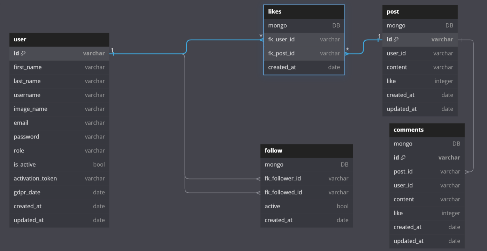

# Brief-6

## base de donnée :

shéma relationnel de ma base de donnée

mySQL a gauche et mongoDB a droite.
pour la partie de droite, les relations ne sont qu'une représentation, ça ressemble plus a ça
